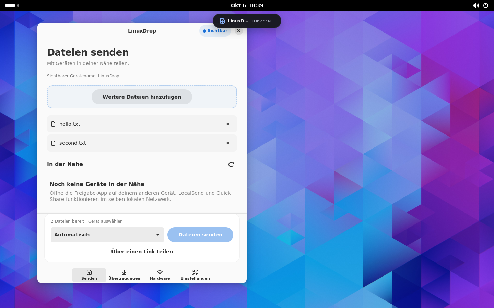

# LinuxDrop
Native nearby file sharing for Linux, with a GTK4/libadwaita app and an optional GNOME desktop notch.

Drop files, choose a device, and send. Incoming requests require approval. Sending, transfers, wireless hardware and settings have separate pages; the background service continues independently of the app window.



## Current release: 0.1.0 experimental

This repository contains real protocol implementations. Ubuntu 24.04 amd64 is the initial package target. GNOME 46/Wayland and protocol loopback tests have been exercised in a dedicated Ubuntu WSL2 environment. **Apple/Android device interoperability and physical radio behavior are not yet verified for LinuxDrop.**

| Backend | Implemented | Validation boundary |
|---|---|---|
| LocalSend | Multicast discovery, HTTP(S) send/receive, approval, cancellation, multiple/empty files, certificate pinning; optional PIN-protected reverse download | Real TLS tests and native GUI receive; official device-client testing pending |
| Quick Share / Nearby Share | One backend: LAN discovery, UKEY2, code comparison in both directions, send/receive, BlueZ and negotiated direct upgrade | Actual TCP handshake/file tests; physical Android, Bluetooth and direct-Wi-Fi tests pending |
| AirDrop | AWDL helper, discovery, TLS Discover/Ask/Upload, send/receive, consent, strict archives and optional BLE wake | Actual TLS protocol tests; dedicated radio and Apple-device tests pending; Everyone mode only |

Quick Share direct upgrade requires an explicitly selected idle adapter. AirDrop requires a suitable dedicated idle adapter and administrator authorization. The current Internet adapter is protected. A VM with virtual Ethernet correctly reports no Wi-Fi/Bluetooth; it can still run the app and LAN transports where the network permits discovery.

## Install

```sh
sudo apt install ./linuxdrop_0.1.0_amd64.deb
```

Open **LinuxDrop** from the app menu. Enable visibility when receiving; it starts hidden. Enable the optional extension in GNOME **Extensions** for Quick Settings and the notch. Log out/in after first installing the extension if GNOME has not discovered it.

Click the LinuxDrop icon in the top panel to open the bubble; it stays hidden until you ask for it. The opened bubble can reveal a native GTK drop surface positioned by the shell, so real Wayland file drags can be received. File-manager actions are included for Nautilus and Dolphin; a Thunar custom-action example is provided.

Full instructions, WSL launcher and troubleshooting: [INSTALL](docs/INSTALL.md).

## Build and check

```sh
sudo sh packaging/dev/setup-ubuntu.sh
# Install rustup for your development user; rust-toolchain.toml pins Rust.
cargo build --locked --workspace
cargo fmt --all --check
cargo clippy --workspace --all-targets --no-deps --locked -- -D warnings
cargo test --workspace --locked
dbus-run-session -- python3 tests/integration/daemon_session.py target/debug/linuxdropd
sh packaging/build-deb.sh
```

The DEB includes the app, user daemon, restricted radio helper, AWDL helper and desktop integrations. A matching source archive is generated beside it. RPM/Arch recipes are provided; their native installation has not been validated.

## Design and evidence

- [Architecture and IPC](docs/ARCHITECTURE.md)
- [Protocol engines and interoperability boundaries](docs/adr/0002-protocol-engines.md)
- [Hardware and packaging](docs/HARDWARE_AND_PACKAGING.md)
- [Implementation and acceptance status](docs/PROGRESS.md)
- [Security policy](SECURITY.md)

- [Agent implementation plan](docs/AGENT_IMPLEMENTATION_PLAN.md) — product design,
  GNOME notch, settings, hardware detection, architecture, and acceptance criteria.
- [Initial implementation report](docs/IMPLEMENTATION_REPORT.md) — starting state
  and architectural background.

LinuxDrop is GPL-3.0-only. Reused sources retain their notices and pinned revisions: [vendor provenance](vendor/PROTOCOL_SOURCES.md). This project is not affiliated with Apple or Google.
