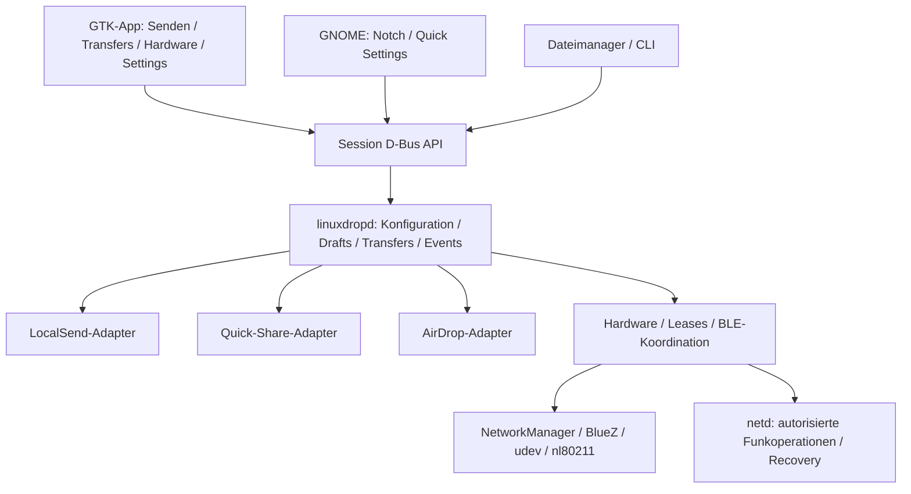

# LinuxDrop: vollständiger Arbeitsplan für den Implementierungsagenten

Datum: 2026-10-06. Status: recherchierte Produktspezifikation und Ausführungsplan, noch keine Produktimplementierung. Dieses Dokument erweitert `IMPLEMENTATION_REPORT.md` und hat bei UI, Notch, Einstellungen und Reihenfolge Vorrang. Bestehende Sicherheitsregeln bleiben gültig.

## 1. Auftrag und Produktversprechen

Baue eine hochwertige native Linux-Anwendung für Senden und Empfangen über LocalSend, Quick Share und experimentelles AirDrop. Der alltägliche Vorgang ist: öffnen, Dateien hineinziehen, Gerät auswählen, senden. Die Desktop-Notch bietet denselben schnellen Einstieg und zeigt laufende Transfers. Umfangreiche Einstellungen und Hardwarediagnose liegen in separaten Ansichten. Der normale Betrieb benötigt kein Terminal.

Die Prioritäten des Nutzers sind verbindlich: schnelle, aufgeräumte Sendeoberfläche; Bubble/Notch oben am Bildschirm; viele sinnvoll gruppierte Einstellungen; verlässliche Hardwareerkennung; sauber getrennte Backends; hochwertige Animation und echte Linux-Integration. Hoher Agentenaufwand soll in nachgewiesene Qualität fließen. Ein großes Modell ersetzt weder Hardwaretests noch eine überprüfte Architektur.

Implementiere zusammenhängende, abnehmbare Schritte. Behaupte keine Kompatibilität, die nur aus README-Aussagen eines anderen Projekts abgeleitet wurde. Liefere keine simulierte Discovery als produktive Funktion und keine Attrappen für nicht verfügbare Backends.

## 2. Entscheidungen und technische Grundlage

| Bereich | Entscheidung | Begründung / Grenze |
|---|---|---|
| Core und Daemon | Rust, Tokio, zbus | getrennte Zustands- und Netzwerklogik, asynchrone IPC |
| Haupt-App | gtk-rs mit GTK4/libadwaita | native Dateiauswahl, Accessibility, adaptive Navigation |
| Desktop-Notch | GJS, St/Clutter in GNOME Shell | echte Shell-Einbindung statt eines frei positionierten GTK-Fensters |
| Einstellungen | eigene App-Seite mit Kategorien und Suche | viele Optionen ohne Überladen der Sendeansicht |
| einfacher Einstellungsdialog | Adw.PreferencesDialog bei passender Mindestversion | PreferencesWindow ist ab libadwaita 1.6 deprecated [S2] |
| WLAN | nl80211 plus NetworkManager-D-Bus | Funkfähigkeiten und aktuelle Netzverwendung sind verschiedene Informationen |
| USB/PCI-Inventar | udev/sysfs, ereignisbasiert | stabile Identität und Hotplug statt hartem `wlan0` |
| Bluetooth | BlueZ-D-Bus | getrennt vom WLAN; Advertising-Ressourcen begrenzt [S8] |
| Privilegien | separater netd erst bei Bedarf | GUI und Dateitransferdienst bleiben unprivilegiert |
| erstes Protokoll | LocalSend Upload-API v2 | überschaubare vollständige vertikale Produktfunktion |
| Quick Share | bestehende Rust-Cores evaluieren, Adapter bauen | Kryptografie und Parser nicht grundlos neu schreiben |
| AirDrop | isolierter AWDL-/AirDrop-Prototyp, danach Integration | Hardware- und iOS-Abhängigkeiten vor Produktversprechen klären |
| Paketformat | zuerst natives DEB | Host-Dienst und Hardwarehelfer gemeinsam integrierbar |

Der Agent legt vor dem ersten GTK-Code Mindestversionen anhand realer Paketverfügbarkeit fest. Vorschlag für das erste Entwicklungsziel: GTK >= 4.12, libadwaita >= 1.5; keine Alpha-API verwenden. Unterstützte Ubuntu-/Fedora-Versionen erst nach Paketprüfung benennen. Die Notch erhält eine eigene Shell-Versionsmatrix. „GNOME 45+“ ist eine Dokumentationsgrenze der Quick-Settings-Beispiele, keine pauschale Kompatibilitätszusage [S1].

## 3. Drei getrennte Bedienflächen

### A. Schnell senden

App-Start öffnet eine kompakte Ansicht, etwa 560 × 640 logische Pixel als Designausgangspunkt. Oben: LinuxDrop, diskreter Sichtbarkeitsstatus, Menü. Mitte: große Dropzone mit „Dateien hier ablegen“ und „Dateien auswählen“. Darunter nahe Geräte als übersichtliche Karten oder Zeilen mit Symbol, Name und Status. Kein Hardwareinventar und keine lange Einstellungsleiste in dieser Ansicht.

Die Navigation führt zu **Senden**, **Transfers**, **Hardware** und **Einstellungen**. Große Fenster können eine Seitenleiste zeigen; kleine Fenster wechseln zu einer adaptiven Navigation. Die finale Umsetzung verwendet dafür geeignete libadwaita-Widgets [S3]. Gerätekarten sind eine Produktentscheidung, keine Vorgabe, ein bestehendes Fremdprojekt zu kopieren.

Dateien zuerst: Drop → kompakte Dateiliste → Gerät wählen → Senden. Gerät zuerst: Gerät wählen → Dateien droppen/auswählen → Senden. Beide Pfade verwenden denselben Draft. Drop löst niemals ungefragt einen Netztransfer aus. Ein Gerät darf verschwinden, während der Draft erhalten bleibt. Ungültige Dateien werden einzeln mit Grund markiert.

GTK empfängt Gdk.FileList über Gtk.DropTarget; asynchrone Datenformate bei Bedarf über DropTargetAsync [S4/S5]. URI-Decoding erfolgt über Gio, nicht per String-Tricks. Unterstütze reguläre lokale Dateien zuerst; Ordner und entfernte GVfs-Dateien sind spätere explizite Funktionen. Eine Datei mit 0 Bytes ist ein gültiger Testfall, kein pauschal ungültiger Inhalt.

### B. Desktop-Notch

Die Notch ist ein kleiner, gerundeter, oben mittig angeordneter Shell-Actor. Sie hat einen kompakten Zustand und eine nach unten öffnende Fläche. Sie darf Uhr, Topbar-Menüs und Bildschirmkantenaktionen nicht blockieren. Bei Platzkonflikt unterhalb der Topbar platzieren; Ausrichtung und Abstand sind einstellbar. Keine Nachahmung eines physischen Displayausschnitts erforderlich.

| Zustand | Darstellung und Aktion |
|---|---|
| Ruhe | kleines LinuxDrop-Symbol, Klick öffnet Schnellmenü |
| Datei-Drag in Zielnähe | vergrößerte Dropzone, eindeutige Drop-Hervorhebung |
| Dateien bereit | Anzahl/Größe, Geräteauswahl, Senden |
| Discovery | dezenter Status, keine dauernde pulsierende Animation |
| ausgehend | Richtung, Gerät, aggregierter Fortschritt; Klick zeigt Details |
| eingehend | Absender, Anzahl/Größe, Annehmen und Ablehnen |
| Vergleich erforderlich | Quick-Share-Code, eindeutige Bestätigung/Ablehnung |
| mehrere Transfers | Anzahl, Auswahl; kein wahlloser Wechsel zwischen Geräten |
| abgeschlossen | kurzer Erfolg, Öffnen/Ordner; danach Rückkehr zur Ruhe |
| Fehler | verständlicher Grund, Details in der App |

Animationen zunächst 160–240 ms als Designwerte; kein Springen der Monitorposition während einer Aktion. Respektiere reduzierte Bewegung. Escape schließt, Enter aktiviert die fokussierte Aktion; sichtbare Fokuszustände und Screenreader-Namen sind Pflicht. Hover allein darf keine wesentliche Aktion auslösen. Die Notch kann ausgeschaltet werden, ohne Dienst oder Transfers zu beenden.

Multi-Monitor: standardmäßig Hauptmonitor; optional Bildschirm des Zeigers oder fest gewählter Monitor. Laufende Interaktion nicht während Monitorwechsel verschieben. Skalierung 100/125/150/200 Prozent, unterschiedliche Auflösungen, Vollbild, Overview, Hotplug und suspend/resume prüfen. Gesperrter Bildschirm zeigt keine Dateinamen, Absenderdetails oder Annahmeaktionen. Standardmäßig keine neuen Empfangszusagen im Lock-Zustand. Entsperren synchronisiert den aktuellen Dienstzustand.

**Verbindlicher Forschungs-Gate für direkte Datei-Drops:** Shell-internes Actor-DND ist nicht automatisch ein externer Datei-Drop. Der recherchierte `xdndHandler.js` meldet Drag-Beginn/-Position/-Ende; daraus folgt kein fertiger Zugriff auf Dateiinhalte [S6]. Vor Notch-Architekturabschluss beweisen: Nautilus → Shell-Ziel auf nativer Wayland-Sitzung, echte lokale Mehrfachauswahl, korrekt gelesene URI-/Portal-Dateiliste, Sandboxquelle, cancel/repeated drag und gültige Dateiöffnung nach Drop.

Prüfreihenfolge: APIs der konkret unterstützten Shell-/Mutter-Version untersuchen; externer DND-Payload als isolierten Spike umsetzen; Kopplung an private APIs dokumentieren. Keine Shell-Monkeypatches ohne eng begrenzten Versionsadapter und Recovery-Test. Keine neuen Compositor-Protokolle als angeblich portable Lösung darstellen.

Falls direkter Shell-Drop nicht zuverlässig möglich ist: transparent dokumentieren und zunächst Notch als Klick-/Statusfläche mit einer regulären GTK-Dropfläche verwenden. Eventuell Hover während Drag zum Aktivieren einer vorbereiteten GTK-Fläche untersuchen; Fokus/Activation unter Wayland separat testen. Dies ist eine Zwischenlösung, keine Erfüllung des verlangten direkten Notch-Drops. Feature nicht stillschweigend streichen; Entscheidung und verbleibende Produktlücke vor einer stabilen Freigabe vorlegen.

### C. Einstellungen und Hardware

Die Einstellungen sind ein eigener vollständiger Bereich. Kategorien bleiben sichtbar, Suche durchsucht Labels und Beschreibungen. Standardansicht zeigt Alltagsoptionen; ein gekennzeichneter Bereich „Erweitert“ ergänzt Diagnose- und Netzwerkoptionen. Jede Option besitzt Default, Validierung, Wirkung, Verfügbarkeit und Persistenz. Keine funktionslosen Schalter für zukünftige Implementierungen.

## 4. Einstellungsinventar und sichere Defaults

Alle Werte sind vorgeschlagene Produktdefaults und werden in einem versionierten Schema festgehalten. UI zeigt gewünschte und wirksame Konfiguration bei Abweichungen getrennt. Einstellungenänderungen laufen über den Dienst, validiert und atomar. Die Shell schreibt nur ihre rein visuellen Einstellungen selbst.

| Kategorie | Optionen | Default / Regeln |
|---|---|---|
| Allgemein | Gerätename, Sprache, Darstellung, Autostart, Verhalten beim Fensterschließen | System-Sprache/-Darstellung; Autostart zunächst bewusst aktivieren; Fensterschließen beendet keine aktiven Transfers |
| Empfang | Zielordner, pro Anfrage anderen Ordner wählen, Kollisionen, Unterordner pro Absender/Datum | XDG-Downloads/LinuxDrop; Umbenennen ohne Überschreiben; Unterordner aus |
| Empfangsschutz | Bestätigung, Öffnen nach Empfang, Ordner nach Empfang, maximale Größe/Dateianzahl | Bestätigung an; automatisches Öffnen aus; Limits explizit dokumentieren |
| Sichtbarkeit | unsichtbar, zeitlich öffentlich, dauerhaft öffentlich, Dauer, bei Sperre verbergen | zuerst unsichtbar; manuelles öffentliches Fenster 10 min; kein „Kontakte“ ohne Identitätsmodell |
| Geräte | Favoriten, Vergessen, Blockieren, Anzeigename, Protokollpräferenz | Vertrauen nie aus Namen/IP ableiten; Blockierung an Identitätsqualität koppeln |
| LocalSend | ein/aus, HTTPS, Port, Discovery-Interface, Multicast | Backend an, effektive Discovery an Sichtbarkeit gebunden; HTTPS; Port 53317; kein automatischer Subnetzscan |
| Quick Share | ein/aus, BLE-Discovery, statischer Listen-Port, Codevergleich | nach verfügbarer Implementierung aktivierbar; Vergleich erzwingen; BLE-Status anzeigen |
| AirDrop | experimentell aktivieren, Empfang/Senden, BLE-Wakeup, Hardwareprofil | zunächst aus; Funktionen nur nach eigenem Interop-Nachweis anzeigen |
| WLAN-Hardware | automatische Wahl, bevorzugter Adapter, dedizierten USB-Adapter bevorzugen, Hotplug verwenden | automatische nicht-invasive Wahl; Internetadapter geschützt |
| Hardwareprüfung | passive Diagnose, expliziter aktiver Test, bekannte Profile, Recovery anzeigen | aktive Monitor-/Injection-Tests niemals automatisch beim Einstecken |
| Bluetooth | Controllerwahl, Bereitschaft, Advertising-Konflikte | automatisch unter geeigneten Controllern wählen; andere Apps nicht verdrängen |
| Notch | aktiviert, Position, Monitor, kompakte Größe, bei Vollbild verbergen, automatisch einklappen | an nach Extension-Installation; Hauptmonitor; Vollbild ausblenden; Nutzeraktionen nicht verlieren |
| Bewegung/Bedienung | Animation, Systemvorgabe, Tastenkürzel, Drag-Hover-Dauer | Systemvorgabe; Kürzel erst nach konfliktfreier Integration |
| Benachrichtigungen | Empfangsanfragen, Fertigmeldung, Fehler, Ton, sensible Inhalte | Anfragen/Fehler an, Ton aus, Sperrbildschirm privat |
| Transfers | parallele Jobs, Bandbreitenlimit, Historie, Aufbewahrung | begrenzte Parallelität; kein automatischer Retry eines teilweise gesendeten Transfers |
| Netzwerk erweitert | zugelassene Interfaces, VPN-/virtuelle Netze, feste Ports, IPv4/IPv6-Status | lokale geeignete Netze; Loopback ausschließen; VPN nicht ungefragt announcen |
| Diagnose | Log-Level, redigierter Export, Versionen, Berechtigungen, Dienstneustart | keine Nutzdaten/Keys; Neustart bei aktiven Jobs vorher erklären |

Globale automatische Annahme wird nicht als Komfortdefault gebaut. Favoriten sind keine vertrauenswürdigen kryptografischen Identitäten. Bei einem späteren Trust-Modell erst Protokollfähigkeiten und Widerruf definieren. Unwirksame Optionen erklären konkret „Bluetooth ausgeschaltet“ oder „Adapter unterstützt keinen geprüften AWDL-Pfad“.

## 5. Hardwaremodell und Auswahlalgorithmus

Inventar umfasst PhysicalRadio, NetworkInterface und BluetoothController als getrennte Objekte. USB-/PCI-Pfad plus IDs und vorhandene Serienkennung unterstützen stabile Auswahl; fehlende Serienkennung wird markiert. Interface-Name und ifindex sind Laufzeitwerte und können sich ändern. Mehrere VIFs desselben wiphy sind keine unabhängigen Funkadapter.

Zu jedem Radio speichern: Bus, VID/PID oder PCI-IDs, Treiber/Firmware, Kernel, wiphy, Bänder/Kanäle, regulatorische Einschränkungen, rfkill, unterstützte Interface-Modi und -Kombinationen, NetworkManager-Zustand, aktive Verbindung, aktuelle Nutzung, Prüfprofil und letzter Testerfolg. Kernel-fähige Kombinationen sind Voraussetzung für gleichzeitige Rollen, aber kein Beweis für gute Laufzeitqualität [S7].

Fähigkeit ist ein Datensatz: `value = yes/no/unknown`, Quelle, Prüfzeit, Software-/Hardwarekontext und Evidenz. Beispiele: Monitor gemeldet; Managementframe-Injection getestet; Datenframe-Injection unbekannt; AirDrop Receive mit bestimmter iOS-Version getestet. Eine generische Injection-Checkbox reicht nicht.

**Auswahl:** zuerst harte Ausschlüsse, dann Ranking. Ausschließen: rfkill, fehlender Treiber, verbotener Kanal, bereits geleaster Adapter, erforderliche Fähigkeit fehlt, geschützter Internetadapter würde unterbrochen. Danach bevorzugte geeignete Hardware; dedizierte getestete USB-Hardware; freie getestete interne Hardware; andere Kandidaten nur mit expliziter aktiver Prüfung. LAN-Backends können Ethernet nutzen und benötigen keinen AWDL-Adapter. Kein erzwungener Wechsel zu schlechterer Hardware nur wegen höherer USB-Priorität.

Hardwaremanager erzeugt einen nachvollziehbaren SelectionDecision mit Kandidaten, Ausschlussgründen und Auswirkungen. GUI zeigt „AR9271: 2,4 GHz, AWDL nicht geprüft“ statt „AirDrop unterstützt“. Hardwareprofile bleiben lokal versioniert; keine stillen Fernupdates mit ausführbarem Code.

Hotplug-Lebenszyklus: Event → kurz entprellen → passive Inventarisierung → Bereitschaft bewerten → UI aktualisieren. Aktiven Transfer nicht ungeprüft auf neue Funkhardware migrieren. Entfernung löst typisierten Fehler oder nachgewiesenen Protokoll-Recovery aus. Bei mehreren Backends gibt ein LeaseManager exklusiven Zugriff auf mutierende Funkrollen; konkurrierende BLE-Advertisements werden koordiniert. BlueZ-Limits prüfen, Registrierungen auf Stop entfernen [S8].

## 6. Architektur, Zuständigkeiten und IPC



Core enthält reine Domänenmodelle und Zustandsautomaten. Backend-Crates enthalten Protokoll-/Transportlogik und keine Widgets. linuxdropd ist Eigentümer von PeerRegistry, TransferCoordinator, ReceiveStore, ConfigStore und NotificationCoordinator. Hardwarecode ist unabhängig von App-Widgets. netd verwaltet keine frei gewählten Empfangspfade oder Downloadinhalte.

Drafts sind vorbereitete Dateiauswahlen; sie sind von laufenden Transfers getrennt und haben begrenzte Lebensdauer. Dateien werden validiert und geöffnet, bevor der Transfer startet. Dateideskriptoren vermindern Pfadwechselrisiken, verhindern aber keine Inhaltsänderung durch andere Prozesse. Länge und Integrität während Übertragung prüfen; produktseitig keine automatische Vollkopie großer Quellen voraussetzen.

Versioniertes D-Bus-Interface, dokumentiertes XML und Client-Crate. Methoden: GetSnapshot, PrepareSend/AddFiles/DiscardDraft, StartSend, Accept/Reject/Cancel, Get/UpdateSettings, ListAdapters, SetPreferredAdapter, GetDiagnostics und OpenApplication. Exakte Signaturen in M0 festlegen; FD-Listen portionsweise übertragen und Limits berücksichtigen. Snapshot besitzt Dienst-Epoch und monotone Revision. Signal vor Snapshot abonnieren, Ereignisse puffern, Snapshot installieren, spätere Revisionen anwenden. Ein optionaler GetChangesSince-Pfad muss begrenzten Verlauf und Resync unterstützen.

Mutationen sind idempotent oder besitzen einen Request-Token. Doppelklick, doppelte Notification-Aktion und konkurrierendes Accept/Reject führen zu genau einer gültigen Entscheidung. InFlight-Cancellation muss Reader/Writer und Eventproduzenten tatsächlich stoppen. Terminalzustände bleiben unveränderlich. Fortschritt wird begrenzt zusammengefasst, z.B. höchstens 10 UI-Ereignisse/s/Transfer; Abschluss sofort. Langsame UI darf Netzwerk nicht blockieren.

D-Bus-Sessionzugriff ist kein Schutz gegen einen bösartigen Prozess desselben Users. Dieses Bedrohungsmodell dokumentieren. Privilegierte Helper-Methoden prüfen auf System-Bus/Socket den echten Absender, Session und Autorisierung; keine selbst behauptete UID akzeptieren. Hardware-Lease und clientgebundener Recovery-Zustand werden beim Verbindungsverlust aufgelöst.

Konfiguration: eine zentrale versionierte Datei unter XDG_CONFIG_HOME, atomare Änderungen und Migration. GUI-Präsentationseinstellungen dürfen getrennt bleiben. Private Identitätsschlüssel liegen mit restriktiven Rechten im Datenspeicher; UI-Proxies speichern keine Kopien. Transferhistorie ist begrenzt, separat löschbar und enthält keine Schlüssel. Logs werden standardmäßig redigiert.

## 7. Protokollstrategie und Reuse

**LocalSend:** Discovery, TLS-Identität, register, prepare-upload, upload und cancel nach gepinnter v2-Spezifikation. Server-seitige Tokens nur für akzeptierte Dateien; Auth-/Sessionprüfung bei jedem Upload. Ablehnung, Ablauf und Teilannahme testen. Reverse-Download und weitere v2.2-API separat implementieren, bevor „vollständig v2.2“ behauptet wird [S9]. TLS und Fingerprint-Modell mit dem offiziellen Client prüfen; keine wahllos global deaktivierte Zertifikatsprüfung.

**Quick Share:** Packet nutzt laut README LAN und Bluetooth [S10]. RQuickShare ist eine etablierte Referenz, kein Nachweis für jede Android-Version [S11]. Zusätzlich wurde open-quickshare gefunden; das Projekt behauptet LAN/Wi-Fi Direct/BLE. Vor Wahl Build, Tests, Parser, Kryptografie, Cancellation, Lizenz und reale Interop evaluieren [S12]. Ergebnis als ADR mit Vergleich festhalten. Protobuf-/UKEY2-Nachrichten begrenzen, SAS korrekt zur ausgehandelten Sitzung binden; keine selbst entworfene Ersatzkryptografie. Nicht voraussetzen, dass identische Geräteamen Vertrauen begründen.

**AirDrop:** opendrop-rs und airdrop-mt7921 bieten unterschiedliche Ansatzpunkte [S13/S14]. Letzteres behauptet iOS-26-Senden und -Empfangen; das ist eine Projektbehauptung und muss auf unseren Geräten reproduziert werden. Rust-Integration erst nach funktionierendem isoliertem Pfad wählen. Die AirDrop-HTTP-Ebene und der AWDL-Link bleiben getrennt. Archiv-/CPIO-/dvzip-Verarbeitung benötigt eigene Begrenzung, Traversal- und Dekompressionsprüfung. Apple-Kontaktidentitäten und Weblinks sind keine zugesagten Funktionen.

Alle Reuse-Entscheidungen pinnen Commit und API; eine kleine Adaptergrenze schützt die Domäne vor Fremdtyp-Leaks. GPLv3 ist die vorgeschlagene LinuxDrop-Lizenz. GitHub-Metadaten allein entscheiden keine genaue SPDX-Variante oder Gesamtkompatibilität. LICENSE, Header, transitive Abhängigkeiten und Attribution vor Übernahme prüfen. Nicht pauschal `GPL-3.0-or-later` erfinden; Eigentümerentscheidung dokumentieren. GNOME-Quellcode wird untersucht, nicht ungeprüft hineinkopiert.

## 8. Sicherheits- und Dienstanforderungen

Empfang: validierte Metadaten → Zustimmung → exklusive temporäre Datei im Ziel-Dateisystem → begrenztes Streaming → Prüfung → No-Replace-Abschluss. Keine Shell-Ausführung, keine Netzwerkpfade, kein Folgen unkontrollierter Symlinks. Disk-full, abweichende Länge, Connection loss, Cancellation und ungültige Sessions säubern kontrolliert. Datei- und Archivpfade strikt prüfen; Dateinamen für Anzeige zusätzlich auf problematische Steuerzeichen behandeln. Fuzzing auf exponierte Parser fokussieren.

netd-API nutzt vordefinierte Operationen auf zuvor inventarisierter Hardware. Vor Mutation Snapshot: Managed-Zustand, Interface-Rolle, Kanal, VIFs und Recovery-Verantwortung. Transaktion hat Prepare/Apply/Restore; Startfehler rollt zurück. Nur eigene VIFs entfernen, keine fremden NetworkManager-Verbindungen löschen. Nach Crash Journal/Lease-Zustand prüfen und verständlichen Recovery-Status zeigen. Ein aktiver Internetadapter bleibt geschützt, solange keine ausdrücklich autorisierte Änderung vorliegt.

systemd-User-Service für linuxdropd, D-Bus-Aktivierung und kontrolliertes Autostartverhalten. Kein Doppelstart über mehrere konkurrierende Mechanismen. netd als separater Systemdienst, möglichst unprivilegierter dedizierter Service-User mit nötigen Capabilities. Härten und funktionsprüfen: NoNewPrivileges, CapabilityBoundingSet, Dateisystemschutz, eingeschränkte Schreibpfade und benötigte AddressFamilies. Keine Sandbox-Regel blind setzen, die TAP/nl80211/Raw-Sockets verhindert [S15].

Benachrichtigungen verwenden unterstützte Desktop-Aktionen und stabile Transfer-IDs; fehlende Actions führen zu „App öffnen“. Daemon und Shell koordinieren Präsentation, damit nicht zwei konkurrierende Dialoge erscheinen. Portals sind für sandboxübergreifende Dateien relevant; ihre Berechtigungen können sitzungsgebunden sein [S16]. Keine pauschale Freigabe aller Hostdateien als Produktlösung.

## 9. Ausführungspakete für den Agenten

Jedes Paket liefert Code, relevante Tests, ausgeführte Befehle mit Ergebnissen, Screenshots bei UI, bekannte Grenzen und aktualisierte Fortschrittsdatei. Kein Paket ist fertig, weil nur Dateien angelegt wurden.

| ID | Arbeit und Artefakte | Abhängigkeit | Akzeptanz |
|---|---|---|---|
| P00 | Linux-Entwicklungsziel, Versionen, License-/Reuse-ADR, Toolchain | keine | reproduzierbarer Build-Raum; bestehende Demo nicht verändert |
| P01 | Workspace, Core, CI, Settings-Schema, Transfer-State | P00 | sinnvolle State-/Config-Tests, fmt/clippy/test grün |
| P02 | D-Bus XML, Daemon, Client, Snapshot/Epoch, Draftmodell | P01 | mehrere Clients, Reconnect und doppelte Entscheidungen geprüft |
| P03 | GTK-Sendeansicht, Drop, Auswahldialog, getrennte Navigation | P02 | echte lokale Dateien, Mehrfachauswahl, Tastatur, kleine/große Fenster |
| R01 | Notch plus externer Wayland-DND-Spike | P00 | Payload und Dateiöffnung aus Nautilus und Sandboxquelle; Ergebnis/Gap dokumentiert |
| P04 | LocalSend Discovery und Empfang, ReceiveStore | P02 | offizieller Client, Ablehnen/Accept/Cancel, identische Bytes |
| P05 | LocalSend Senden, GTK-Transfers, Notifications | P03/P04 | beide Richtungen, mehrere/0-Byte/große Dateien, Verlust-/Fehlerfälle |
| P06 | vollständige Settings-Kategorien für vorhandene Features | P05 | Werte validiert/persistent, wirksamer Status, Suche und Reset |
| P07 | passiver Hardwaremanager und Hardwareansicht | P02 | USB/RFKill/Netzwechsel/Serviceverlust; keine Netzwerkmutation |
| R02 | Quick-Share-Core-Vergleich, BLE/SAS-Prototyp | P00 | gepinnte Kandidaten, echter Android-Test, Auswahl-ADR |
| P08 | Quick Share LAN Adapter und UI | P05/R02 | aktuelle Pixel-/Samsung-Matrix, SAS, Cancel, keine falschen Ready-Zustände |
| P09 | produktive Notch/Quick Settings | R01/P02/P05 | direkter Drop oder klar benannte Produktlücke; enable/disable/Lock/Monitore |
| P10 | Nautilus, CLI, Desktopfile/AppStream | P05 | Mehrfachauswahl und Leerzeichen/Unicode, kein Shell-Stringbau |
| R03 | AirDrop isoliert, Hardwarematrix, aktive Prüfungen | P07 | eigener echter Apple-Transfer und Wiederherstellung belegbar |
| P11 | netd, Leases, Crash-/Hotplug-Recovery | R03 | autorisierte API, Crash und Unplug, Internetadapter geschützt |
| P12 | AirDrop Receive | P11/P05 | Apple → Linux, begrenzte Archive, Annahme und Cancel |
| P13 | AirDrop Send/BLE-Wakeup | P12 | Linux → aktive/ruhende Apple-Geräte getrennt abgenommen |
| P14 | LocalSend weitere v2.2-Strecken | P05 | überprüfte Konformitätsmatrix, keine überzogene Versionszusage |
| P15 | DEB-Release, danach RPM/Arch | P06/P09/P10 | frische VM, Upgrade, Uninstall, Service/Extension nicht verwaist |
| P16 | Wi-Fi Direct, Dolphin/Thunar, Flatpak | jeweilige Basis | eigene real geprüfte Funktionen; kein stilles Scope-Verschieben |

R01 und R02 früh untersuchen, um die größten Architekturannahmen vor umfangreicher UI-/Protokollarbeit zu klären. Hardwareinventar entsteht vor privilegiertem AirDrop. Die Notch ist ein zentrales Produktmerkmal und wird nicht bis nach allen Funkprotokollen verschoben.

## 10. Repository-Zielstruktur

```text
crates/linuxdrop-core/src/       models, state, errors, backend
crates/linuxdrop-ipc/            introspection XML, server/client types
crates/linuxdrop-daemon/src/     coordinator, registry, config, notifications
crates/linuxdrop-storage/src/    safe receive store and history
crates/linuxdrop-localsend/src/  wire, discovery, server, client
crates/linuxdrop-hardware/src/  inventory, capabilities, selection, leases
crates/linuxdrop-quickshare/src/ adapter around selected core
crates/linuxdrop-airdrop/src/    app protocol and AWDL adapter
crates/linuxdrop-netd/src/       restricted operations and restoration
app/linuxdrop/                  GTK UI, resources, actions, CLI entry
extensions/gnome-shell/         actors, proxy, settings, version adapters
integrations/nautilus/          menu provider
packaging/                      service, desktop, dbus, polkit, distro recipes
tests/interop/                  reproducible official-client/device matrix
tests/fixtures/                 provenance and bounded wire samples
docs/adr/                       reasoned architecture/reuse decisions
docs/acceptance/                 visual, interop, hardware evidence
docs/PROGRESS.md                 completed, current, blocked and remaining work
```

Crates entstehen mit ihren Paketen; keine Skeleton-Masse vor P01. Ein zentrales Build-System: Cargo für Rust; Meson nur dann für Desktop-Ressourcen einsetzen, wenn Packaging/GTK-Integration es sinnvoll rechtfertigen. Entscheidungen in ADR statt mehrfach konkurrierender Buildpfade.

## 11. Qualität, Messung und Abnahme

UI visuell in einer echten GNOME-Sitzung prüfen: 480 × 600, 800 × 700 und 1440 × 900 logische Pixel; Hell/Dunkel, 125/150/200 Prozent, deutsche und englische längere Labels, Keyboard und Screenreader. Diese Größen sind Testziele, keine Behauptung über schon vorhandene Screenshots. Mockdaten sind nur als ausdrücklich gekennzeichneter Entwicklungsmodus erlaubt.

Designziele: schneller wiederholter App-Start, sofortige Reaktion auf Drop/Click, keine UI-Blockade bei Discovery/Hashing. Ein warmes Fensterziel von etwa 300 ms und ein kaltes Startziel unter 1 s sind vorläufige Messziele auf dokumentierter Referenzhardware. Funkdiscovery besitzt keinen garantierten Subsekundenwert. Messen: CPU/Memory im Idle, BLE-Ressourcen, Eventrate, Throughput, UI-Frameverhalten und große-Datei-RAM. Dateiübertragung streamt statt gesamte Nutzdaten im RAM zu halten.

Protokollmatrix: LocalSend Android/iOS/Windows/macOS; Quick Share mindestens Pixel und Samsung; AirDrop mindestens iPhone und macOS mit konkreten Versionen. Für jede Richtung mehrere Dateien, Unicode, 0 Bytes, große Datei, Reject, Cancel vor/nach Start, fehlender Speicher, Netzwechsel und Neustart prüfen. Nicht erreichbare Geräte markieren die Abnahme als offen; Unit-Tests ersetzen sie nicht.

GNOME-Matrix: jede in metadata.json genannte Version real testen; Wayland zuerst, X11 nur bei erklärter Unterstützung. Extension mehrfach enable/disable; sämtliche Actors, Signals, Timers, D-Bus-Proxies und DND-Monitore entsorgen. Shell-Neustart und daemon-Neustart dürfen keine toten Referenzen erzeugen. Keine private API als versionsstabil dokumentieren.

CI: fmt, clippy workspace/all-targets, Unit-/Integrationstests, getrennte GTK-Buildjobs, Lizenz-/Dependency-Prüfung, XML-/Schema-/Desktopfile-Validierung, Extension-Lint und Paket-Smoketests. Actions und Fremdtools pinnen. HIL ist eigener Job mit angeschlossener Hardware und markierten Voraussetzungen. Ein nicht gestarteter Job ist nicht grün.

Release-Gates: keine unangenommene Speicherung; keine überschriebenen Dateien; keine Internetadapter-Unterbrechung; keine falschen Erfolgsmeldungen; nachgewiesene Kerninterop; nachvollziehbare Experimental-Labels; funktionsfähige Paketinstallation; keine offenen kritischen Sicherheitsfehler. Für 1.0 muss die direkte Notch-Drop-Anforderung erfüllt oder ausdrücklich neu entschieden sein.

## 12. Quellen und recherchierte Referenzstände

Alle Quellen am 2026-10-06 geprüft. Fremdprojekt-README-Aussagen sind mit „behauptet/beschreibt“ gekennzeichnet. Verlinkte Entwicklungsdokumentation kann neuer als installierte Distro-Versionen sein; Agent muss APIs gegen das festgelegte Ziel prüfen.

- S1: [GNOME Quick Settings](https://gjs.guide/extensions/topics/quick-settings.html).
- S2: [PreferencesDialog](https://gnome.pages.gitlab.gnome.org/libadwaita/doc/main/class.PreferencesDialog.html), [PreferencesWindow Deprecation](https://gnome.pages.gitlab.gnome.org/libadwaita/doc/main/class.PreferencesWindow.html).
- S3: [NavigationSplitView](https://gnome.pages.gitlab.gnome.org/libadwaita/doc/main/class.NavigationSplitView.html).
- S4: [Gtk.DropTarget](https://docs.gtk.org/gtk4/class.DropTarget.html).
- S5: [Gdk.FileList](https://docs.gtk.org/gdk4/struct.FileList.html).
- S6: [GNOME external DND source](https://github.com/GNOME/gnome-shell/blob/f9cd9aaedf046ab75ab6d5e9d110ec126ff34995/js/ui/xdndHandler.js); Quelle untersucht, kein fertiger Notch-Drop-Nachweis.
- S7: [Kernel cfg80211](https://docs.kernel.org/driver-api/80211/cfg80211.html), [NetworkManager Wi-Fi P2P](https://networkmanager.pages.freedesktop.org/NetworkManager/NetworkManager/gdbus-org.freedesktop.NetworkManager.Device.WifiP2P.html).
- S8: [BlueZ Advertising API](https://bluez.readthedocs.io/en/latest/advertising-api/).
- S9: [LocalSend protocol](https://github.com/localsend/protocol/tree/62bd3406ec80d62f2ed46269cdc06c4dcc391083).
- S10: [Packet](https://github.com/nozwock/packet/tree/1e9fc400020b6fcdbae6ed586872a8d17b6fde26).
- S11: [RQuickShare](https://github.com/Martichou/rquickshare/tree/378d8ae969941bee4bf60ad34ac9cf8bb7005eb7).
- S12: [open-quickshare](https://github.com/ignotusbucius/open-quickshare/tree/5a31145163ee22ab9cf1c7d3dffd74355febe93f).
- S13: [opendrop-rs](https://github.com/ayourtch-llm/opendrop-rs/tree/dccc798e244363eb92d35e3c52e9a913188dda91).
- S14: [airdrop-mt7921](https://github.com/jedbillyb/airdrop-mt7921/tree/9f22b77be06a325e66cf600910a494efa71d76d7), [OWL](https://github.com/seemoo-lab/owl/tree/da255a70f221784c836d943dd3f243bc798f223b).
- S15: [systemd.exec](https://www.freedesktop.org/software/systemd/man/latest/systemd.exec.html): Referenzadresse; Abruf hier fehlgeschlagen, konkrete Hardening-Flags beim Implementieren lokal prüfen.
- S16: [XDG FileTransfer](https://flatpak.github.io/xdg-desktop-portal/docs/doc-org.freedesktop.portal.FileTransfer.html), [Desktop notifications](https://specifications.freedesktop.org/notification/latest-single/).

## 13. Direkt verwendbarer Agentenauftrag

> Arbeite im Repository `C:\Users\Marius\Projekte\Dev\LinuxDrop`. Lies `docs/AGENT_IMPLEMENTATION_PLAN.md` vollständig sowie `docs/IMPLEMENTATION_REPORT.md`. Setze den Plan schrittweise um, beginnend mit P00–P03 und den frühen Forschungs-Gates R01/R02. Implementiere danach die vollständige LocalSend-Send-/Empfangsstrecke, Einstellungen und passive Hardwareerkennung. Führe GNOME-Notch und echte Protokollinterop zu den dokumentierten Abnahmen. Bewahre vorhandene fremde Änderungen, bestehende Linux-Demos und die aktive Internetverbindung. Verwende keinen Browser als Arbeitsoberfläche ohne ausdrückliche aktuelle Erlaubnis; Quellenrecherche über HTTP/Web-Suche ist möglich. Erfinde keine Hardwareergebnisse. Halte `docs/PROGRESS.md`, ADRs und Abnahmebelege aktuell. Bei fehlender physischer Hardware arbeite an unabhängigen Paketen weiter und benenne die konkrete offene Abnahme. Neue Dienste, aktive Funkänderungen, fremde Codeübernahmen und Veröffentlichungen nur innerhalb der tatsächlich autorisierten Arbeit durchführen. Liefere funktionierende, geprüfte Schritte statt einer Sammlung halbfertiger Backend-Attrappen.
