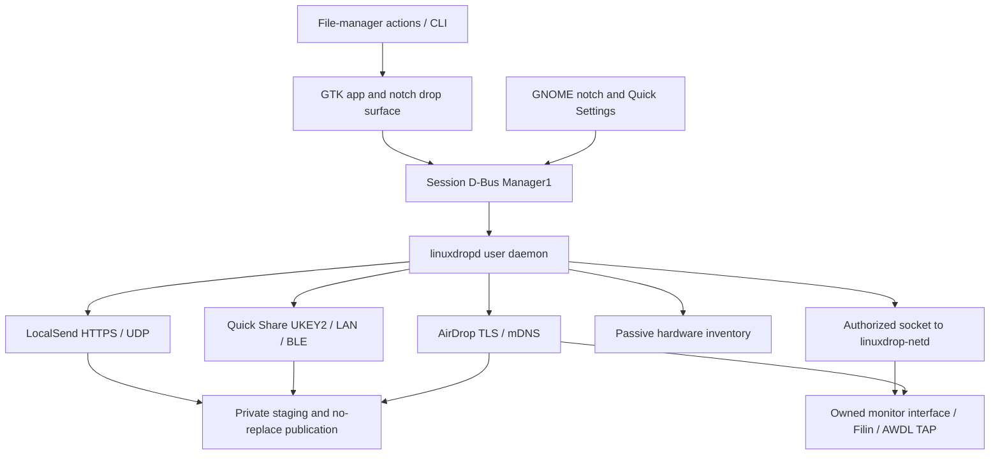

# Implemented architecture

This describes 0.1.0 source behavior. The original plan is design history; acceptance records determine what has been tested.

## Ownership

`linuxdrop-core` contains peers, transfers and backend commands/events. Backends are actors with bounded channels and no GTK objects. `linuxdrop-storage` owns directory-descriptor publication. `linuxdrop-daemon` owns settings, drafts, history, notifications, visibility and backend lifetime. `linuxdrop-hardware` inventories devices and selects eligible radios. `linuxdrop-netd` authorizes radio leases and launches the AWDL helper.

The app ID is `io.github.marius4lui.LinuxDrop.App`; the daemon exclusively owns `io.github.marius4lui.LinuxDrop`. Clients reconnect using a snapshot epoch/revision; `restarting` closes transfer admission during backend transitions. GNOME owns a top-panel button, the explicitly opened bubble and Quick Settings; an undecorated, shell-positioned GTK surface receives actual external Wayland file payloads and passes the selection to the ordinary app. Incoming requests and progress update state without automatically opening a closed bubble. The panel button, Escape and outside clicks control its lifetime.

## Session IPC

`crates/linuxdrop-ipc/manager1.xml` is the canonical wire contract for all 31
methods and `Changed(t)`. `tools/sync-ipc-contract.py` generates shared Rust method
metadata, an optional typed zbus client, and the GNOME interface description.
GTK supplies that description to GDBus and validates outgoing/reply signatures;
GNOME supplies the same description and rejects malformed actions before sending.
CI checks generated files and compares real daemon introspection with the entire
contract. Native packages install the XML under `share/dbus-1/interfaces`.
JSON payload field schemas remain a separate contract; wire signatures alone do
not validate their contents.

Service `io.github.marius4lui.LinuxDrop`, object `/io/github/marius4lui/LinuxDrop`, interface `io.github.marius4lui.LinuxDrop.Manager1`:

| Method | Input | Result |
|---|---|---|
| GetSnapshot | none | JSON epoch, revision, peers, transfers, backends, hardware, settings |
| GetSettings / GetDiagnostics | none | JSON configuration / operational state |
| PrepareSend | absolute host file paths (legacy CLI contract) | temporary draft ID |
| PrepareSendFiles | draft ID (empty to create), array of `(logical name, Unix FD)` | draft ID; append 1?16 regular files atomically |
| ExportReceivedFile | completed incoming saved path | read-only session document-portal path for the installed Flatpak client |
| ResolveReceiveDirectory | document ID, exported basename/relative path (empty for exact grant root) | canonical writable-grant host directory, independent of document-portal lifetime |
| DiscardDraft | draft ID | release selection |
| StartSend | draft ID, peer ID, protocol ID | transfer ID |
| AcceptTransfer / RejectTransfer / CancelTransfer | transfer ID | consent / terminal action |
| SetVisibility | hidden / everyone | bounded-duration visibility |
| UpdateSettings | JSON patch | validated persistence and backend restart |
| ClearHistory | none | remove terminal metadata; keep downloaded files |
| CreateDownloadOffer | draft ID | JSON URL, PIN, expiry, encryption flag |
| StopDownloadOffer | none | revoke download server |
| ReceiveDownloadOffer | explicit local HTTP URL | transfer ID; metadata/PIN then receive review before payload download |
| ProvideTransferPin | transfer ID, PIN | LocalSend upload or download-offer PIN challenge |
| OpenNotchPreferences | none | host GNOME OpenExtensionPrefs for the fixed LinuxDrop extension; bounded failure feedback |
| OpenApplication | none | open native app |

Signal `Changed(revision: u64)` invalidates snapshots. JSON shapes follow `linuxdrop-core` and `settings.rs`. Unknown settings/types are rejected. Incompatible contract changes require Manager2.

## Lifecycle

Settings live in `$XDG_CONFIG_HOME/linuxdrop/settings.json`; TLS identity and terminal history in `$XDG_DATA_HOME/linuxdrop/`, falling back to `~/.config` and `~/.local/share`. Settings/history writes use private mode-0600 temporary files and atomic rename. Public visibility never survives a daemon restart. Autostart is opt-in; ordinary app launches activate the service over D-Bus.

Drafts expire after 30 minutes and are bounded; a one-second maintenance tick releases expired descriptors even when no further selections arrive. The native app opens regular files and uses PrepareSendFiles in batches of at most 16 descriptors. PrepareSend remains available for host path clients. The daemon retains these descriptors through the selected backend or download offer. Replacing, renaming or unlinking the original path cannot substitute another file. Independent readers preserve offsets across simultaneous sends. Size/mtime changes detected before reading require a new selection; this is inode ownership, not an immutable snapshot against concurrent in-place writes. Symbolic links are rejected consistently in the chooser validation and daemon. Terminal transfers cannot be resurrected by stale updates. The history limit bounds finished records. Clearing history retains active transfers and downloaded files. Settings changes during active transfers are rejected.

Hardware refresh follows debounced udev events, with a five-second fallback. A joint allocation maximizes AirDrop and Quick Share radio availability without assigning one wiphy twice. AirDrop gets a lone AWDL radio; Quick Share retains LAN sharing. Both roles exclude protected/active/leased radios and honor USB automation preferences. Eligible hotplug retries are deferred until transfers and download offers are idle, and automatic attempts are bounded per selected attachment. The helper revalidates acquisition, owns created resources and its recovery journal; unrelated interfaces are preserved. See [hardware allocation](HARDWARE_AND_PACKAGING.md) and [current acceptance](completion/PROTOCOL_GAPS.md).

## Compatibility boundaries

Quick Share/Nearby Share use one backend. Direct Wi-Fi is a negotiated upgrade, not universal independent P2P discovery. AirDrop Everyone does not implement Apple Contacts Only. Display names/IPs are not used to merge peer identities. Folder trees, text/contact payloads, resumable transfers and trusted-contact auto-accept are outside 0.1.0.

See [protocol ADR](adr/0002-protocol-engines.md), [hardware design](HARDWARE_AND_PACKAGING.md) and [security policy](../SECURITY.md).

### Backend restart receipts

`CommandSender::shutdown()` waits for a persistent completion receipt from the
backend actor, with a 20-second caller deadline. The deadline does not abort
cleanup. The supervisor stops all old backends concurrently and only starts a
replacement after successful receipts. Failed/timed-out handles stay in a
separate retiring map so a retry can observe their completion without admitting
new transfers into a draining backend. A failed cleanup leaves service status
in error and keeps helper leases alive until a successful retry.

LocalSend tracks its listener/discovery tasks and outgoing jobs. Its axum-server
listener task also waits for the connection watcher count to reach zero: the
server's forced-shutdown return alone does not prove that accepted TLS sockets
have closed. Quick Share waits for its engine tracker; AirDrop waits for its
connection/transfer tracker, cancellation guards and mDNS shutdown response.
BlueZ unregister acknowledgements now use a pinned BlueR lifecycle extension:
Quick Share and AirDrop await registration removal; each advertisement has its
own D-Bus owner, and session dispatcher tasks are cancelled on teardown. A private
BlueZ mock exercises delayed replies, transient failure, capacity and cancellation.
Helper-loss recovery and physical radio acceptance remain separate work.

Reverse-download links use the same persistent shutdown receipt. Revocation and
expiry force-close HTTP connections and await tracked file reads before port
reuse. Pending/failed cleanup remains visible through `download_link_active`.
Explicit revocation cancels streams; StopWhenIdle closes admission under the
same lock used to acquire stream permits and lets existing downloads finish.
A live link blocks backend restarts/network-setting changes. Replacing a link
requires it to have no active streams, then waits for confirmed shutdown; failed
replacement keeps the prepared file selection. The Transfers page exposes a
persistent stop action with retry on failure.
